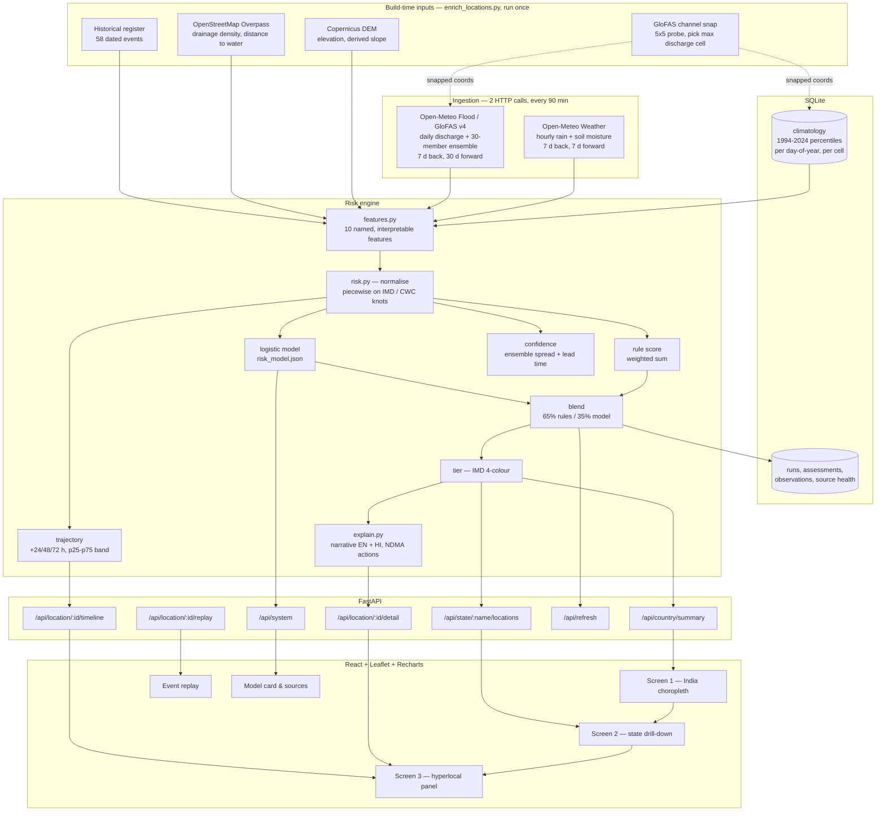

# JalDrishti — Architecture

Companion to the [README](../README.md). This document covers the data flow, the
design decisions that were genuinely contested, and the mistakes that shaped the
current code.

---

## 1. Data flow

## 2. Why the refresh is two requests, not eighty

Open-Meteo accepts many coordinates in one call (`latitude=a,b,c`) and returns a
JSON array in the same order. Forty-one locations therefore cost one weather call
and one flood call per refresh.

The catch is that the free tier bills **one coordinate as one request** against
both a per-minute and a per-hour budget. That single fact shaped three things:

- `BATCH_COORDS = 40` and a `COORDS_PER_MIN = 400` pacing sleep between batches.
- Retry with backoff on 429 rather than treating it as failure.
- The 30-year climatology being built **once** and cached forever, instead of
  computed per request. Building it for 41 locations costs ~1,300 coordinate-calls
  and can exhaust the hourly budget on its own.

## 3. Decisions that were genuinely contested

### PostGIS → SQLite

The original plan called for PostgreSQL + PostGIS. Every spatial question this
app actually asks — "which locations are in Maharashtra", "which GloFAS cell is
nearest" — is answered from 41 rows held in memory. A database server would have
been ceremony. The schema stays normalised enough that swapping in Postgres is a
connection-string change.

### APScheduler → a bare asyncio task

One periodic job does not justify a dependency, and an asyncio task in the FastAPI
lifespan shares the event loop and HTTP connection pool with the request handlers.

### react-leaflet → imperative Leaflet

The map needs per-feature restyling on every refresh *without* rebuilding the
layer, `fitBounds` on drill-down, and custom `divIcon` markers that pulse only at
Red. Expressing that through a component tree cost more than it saved, so
`IndiaMap.jsx` drives Leaflet from effects and keeps layer handles in refs.

### LLM-generated explanations → templates

An LLM call per location would have been non-reproducible, would have needed a key,
and could invent a number that is not in the feature vector. `explain.py` fills
templates from the *actual* top contributions, so the prose and the factor bars
cannot disagree. Hindi is written against the same slots rather than translated
from the English.

### Mean → maximum, for state roll-up

A state with one district at Red and nine at Green is a state with an emergency.
Averaging erases exactly the signal the choropleth exists to show. The map uses
the worst location per state and reports the mean alongside it.

States with **no** monitored location are drawn hatched, as absent data. Painting
them green would claim safety where nothing is measured.

### Hazard and exposure kept separate

The score is a hazard score. Population rides along as exposure and as marker
size. Folding population into the score would make Mumbai outrank a Himalayan
district on identical hydrology, which is a policy judgement the model has no
business making silently.

## 4. Three bugs worth recording

**GloFAS at the town centroid reads the wrong river.** Patna's centroid returns
~10 m³/s; the Ganga beside it carries ~45,000 m³/s. Every major riverine city
scored as dry. Fixed by probing a 5×5 grid of cells and keeping the one with the
largest long-run mean discharge. Verified afterwards against physical
expectations: Brahmaputra ~18,000 m³/s at Guwahati and ~22,000 at Dhubri,
Godavari ~6,300 at Rajahmundry, Mumbai's Mithi ~20 — small, which is correct.

**The climatology and the live reading came from different cells.** Snapping was
added *after* the climatology had been built, so the engine compared a hillside's
30-year history against a main channel's present flow and reported "3,943× the
seasonal median" with a straight face. Fixed by storing the coordinates alongside
each cached baseline and discarding any whose cell no longer matches
(`store.load_climatology(expected_cells)`), so the two can never silently diverge
again.

**The factor bars made every location look maxed out.** The contribution segment
was scaled against the largest contributor, so the top factor's bar was full-width
on every location — a Green location displayed a saturated red bar and read as an
emergency. Now the segment is scaled by that feature's share of the score, so a
feature accounting for a third of the score looks like a third.

## 5. Degradation behaviour

Nothing in the ingestion path raises on a single source failing, because a partial
refresh that reports what degraded is more useful during a live demo than a stack
trace.

| Failure | Behaviour |
|---|---|
| Flood API unavailable | Scores on rainfall + terrain; confidence drops to Low with "river discharge unavailable" written in the UI |
| Climatology missing for a location | Falls back to a short recent-window baseline; confidence penalised; reason shown |
| A refresh fails entirely | Previous good snapshot keeps serving; run recorded as `failed` in the run log |
| Overpass unavailable at build time | Terrain score averages whatever inputs exist; `--missing-only` retries just the gaps across four mirrors |
| Backend still booting | API answers 503; the frontend shows a "first run in flight" screen and polls every 5 s instead of every 60 s |

## 6. Request lifecycle, country view

1. `GET /api/country/summary` → `_require_snapshot()` reads the in-memory
   `Snapshot`. No SQLite, no network on the request path.
2. `state_rollup()` groups 41 assessments by state, takes the max score.
3. `_basin_rollup()` does the same by CWC basin.
4. `explain.national_summary_text()` writes the one-line situation report in both
   languages.
5. The frontend joins the state rows onto `india-states.geojson` by `st_nm` and
   styles each polygon.

A refresh swaps the whole `Snapshot` atomically at the end of a run, so a request
either sees the old complete snapshot or the new one — never a half-updated mix.

## 7. Extending the location set

1. Add rows to `backend/app/data/locations.json` (id, name, name_hi, state,
   district, lat, lon, population, river, basin, coastal, cwc_basin).
2. `python backend/scripts/enrich_locations.py` — derives elevation, slope,
   drainage density, distance to water and the snapped GloFAS cell.
3. Restart the backend. `ensure_climatology()` builds baselines for the new
   locations in the background; they score against a recent-window baseline until
   it lands.
4. Optionally add events to `historical_floods.json`, then re-run
   `train_model.py` and `backtest.py`.

No frontend change is needed — the map, roll-ups and search all derive from the
API.
